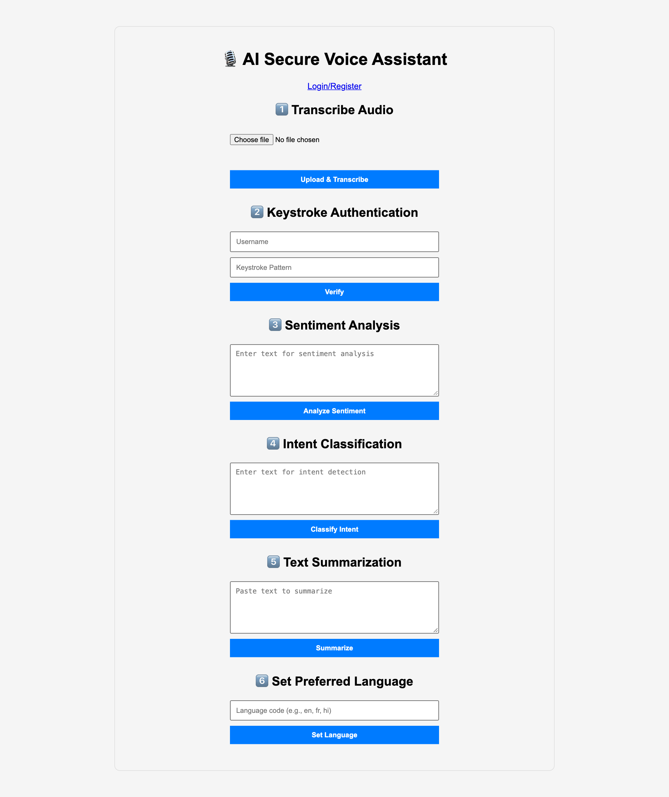
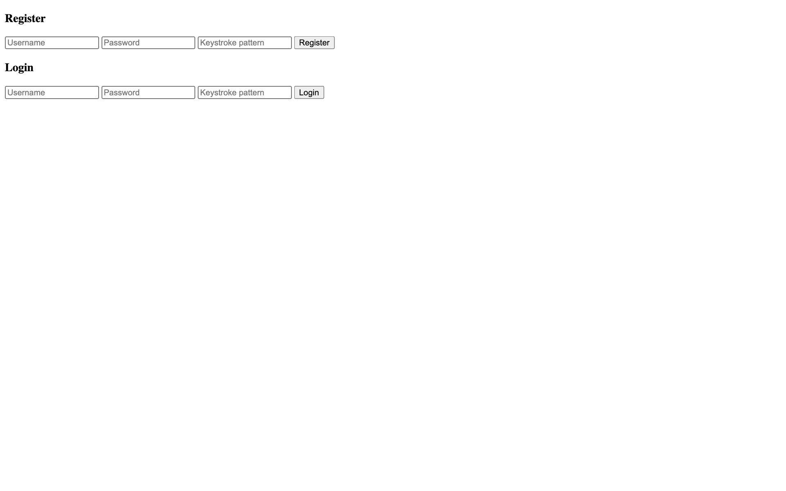
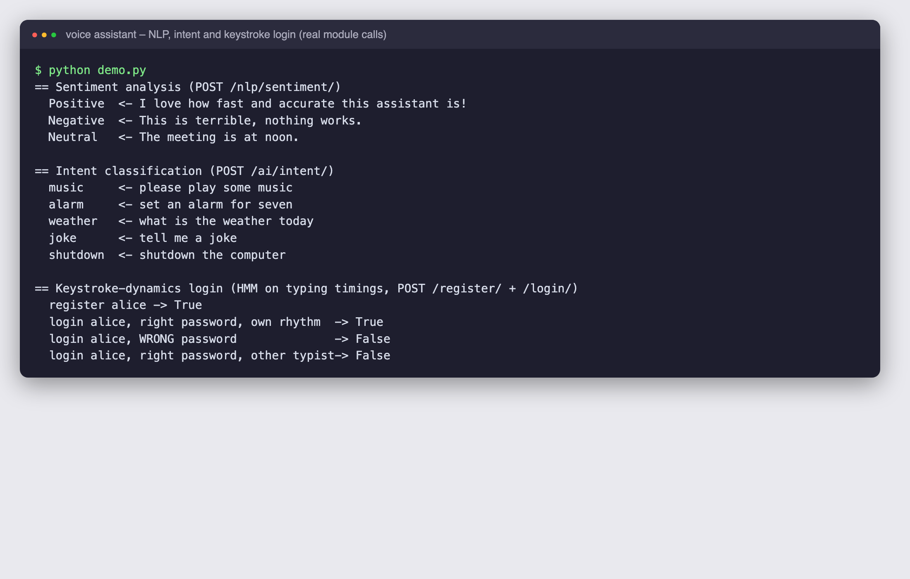

# AI Secure Voice Assistant with Keystroke-Dynamics Login

A privacy-focused, voice-and-text assistant that protects its login with **how you type**, not only what you type. After registering a username, password and typing rhythm, you can transcribe speech, analyse sentiment, detect the intent of a request and summarise long text, all through a simple web dashboard served by a FastAPI backend.

> This repository documents the project (description, design, screenshots). The source code lives in a private repository, `ai_secure_voice_assistant-code`.

## Screenshots

**Dashboard**: six tools on one page (transcribe, keystroke authentication, sentiment, intent, summarisation, language).



**Register / Login** with a keystroke pattern field:



**The AI modules running for real** (sentiment, intent and keystroke login called directly; typing timings in the login demo are synthetic):



## Features
- **Keystroke-dynamics login**: a Gaussian Hidden Markov Model is trained on your typing timings at registration; at login the password must match and the new typing pattern must score above a threshold. A correct password typed with a different rhythm is rejected (see the demo above).
- **Speech to text**: OpenAI Whisper (`base`) transcribes uploaded audio; `pydub` first converts any format to WAV.
- **Sentiment analysis**: TextBlob polarity labels text Positive (above 0.1), Negative (below -0.1) or Neutral.
- **Intent classification**: TF-IDF features and logistic regression map a request to an intent such as music, alarm, weather, joke or shutdown.
- **Summarisation**: a DistilBART model condenses text of 20 words or more into 25 to 80 words.
- **Language setting** field for choosing the processing language.

## How it works
```
Browser (HTML/JS) --HTTP--> FastAPI
   |                           |-- /register, /login ... HMM keystroke model (hmmlearn)
   |                           |-- /transcribe .......... Whisper
   |                           |-- /nlp/sentiment ....... TextBlob
   |                           |-- /ai/intent ........... TF-IDF + LogisticRegression
   |                           '-- /nlp/summarize ....... DistilBART
```
1. The page posts form fields (text, audio file, keystroke pattern) to the matching endpoint.
2. Each endpoint calls a small Python module and returns JSON, for example `{"sentiment": "Positive"}`.
3. For authentication, each typing pattern is turned into a sequence of timing digits; `GaussianHMM(n_components=4)` is fitted per user and later scores a login attempt by log-likelihood.

Extra audio helpers (emotion detection, keyword spotting, noise reduction, speaker diarisation, voice cloning) are included for future integration, and Vue components prepare a richer front end.

## Tech stack
Python, FastAPI, Uvicorn, OpenAI Whisper, pydub/ffmpeg, scikit-learn, hmmlearn, TextBlob, Hugging Face Transformers (DistilBART), PyTorch, HTML/CSS/JavaScript, Vue.

## Authors
Karthik B, Sahana, Priyanka. Licensed under GPL-3.0.
